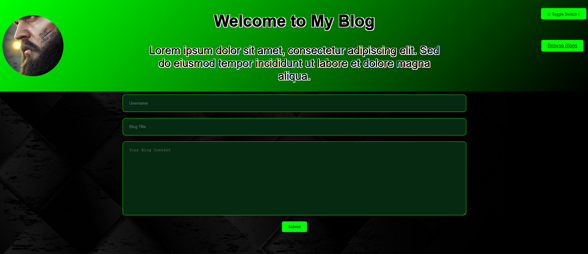

# Mikeit Blog (A play on Reddit)

## Table of Contents

- [Description](#description)
- [Features](#features)
- [Installation](#installation)
- [Usage](#usage)
- [Contributing](#contributing)
- [License](#license)
- [Contact](#contact)
- [Preview](#Preview)

## Description

Mikeit Blog is a simple blogging platform where users can submit their blogs and share their thoughts with the community. The platform provides a clean and intuitive interface for both readers and writers.

## Features

- User-friendly interface
- Submit and read blogs
- Dark mode and light mode support
- Responsive design for all devices

## Installation

1. Clone the repository:
   ```bash
   git clone https://github.com/your-username/mikeit-blog.git

2. Navigate to the blog in Bash
   ```bash
   cd mikeit-blog

3. Navigate to the blog in Bash
   ```bash
   npm install

## Usage

Start the development server:

in bash
Copy code
npm start
Open your browser and navigate to http://localhost:3000 to access the application.

Explore the blog platform, submit your blogs, and enjoy reading!

## Contributing
Contributions are welcome! Please feel free to fork the repository, make your changes, and submit a pull request.

## License
This project is licensed under the MIT License.

## Contact
For any inquiries or support, please contact:

Mike Daigle - Sirdaig@gmail.com


## Preview


